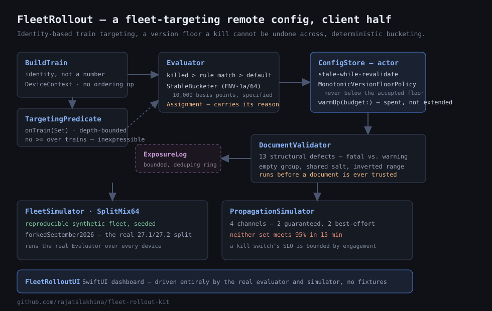
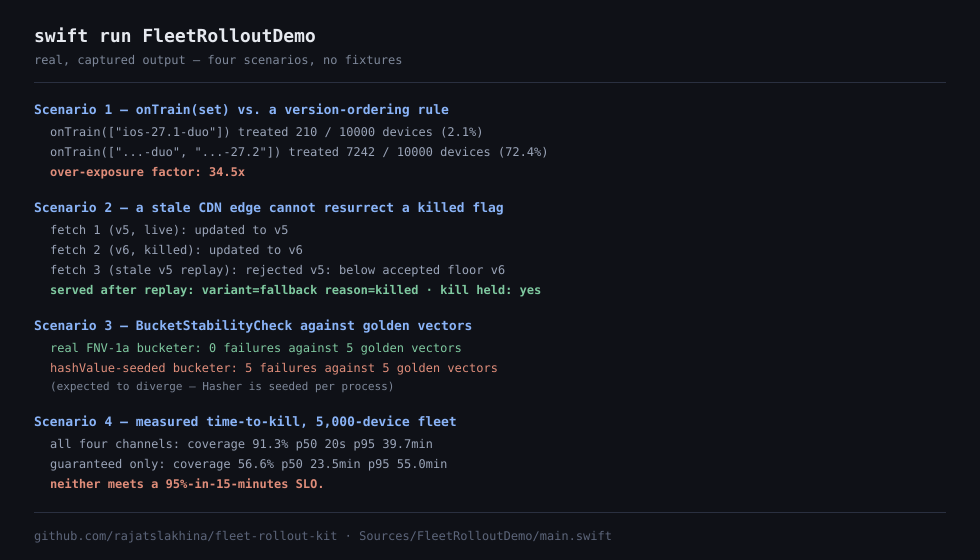
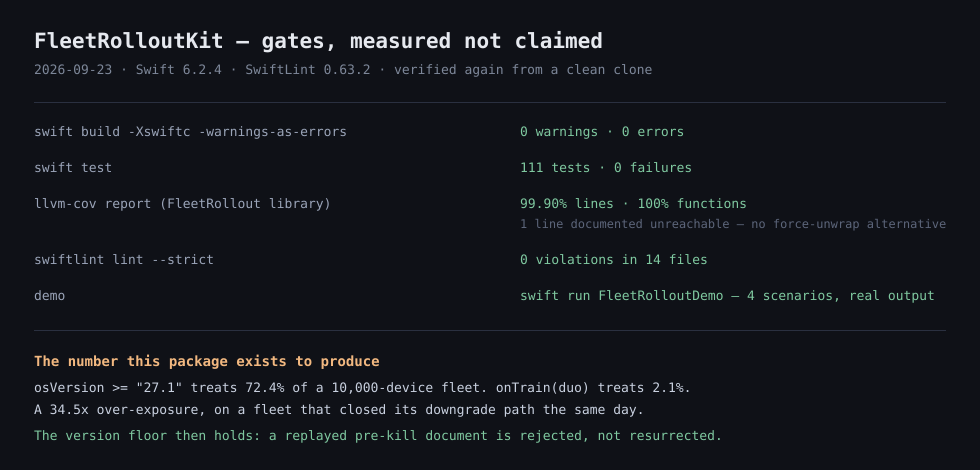

# FleetRollout

**On 21 September 2026 the iOS version stopped being a line, and every feature flag written as `osVersion >= "27.1"` quietly started targeting the wrong fleet.**

iOS 27.1 shipped **only** to iPhone Duo. Every other iPhone went from 27.0 straight to 27.2. A device on 27.2 therefore never executed a single line of 27.1's code — and `>= 27.1` matches it anyway. On the same day, Apple closed the downgrade path off iOS 27, so a user who takes a bad build of your app on a bad OS train cannot roll *themselves* out of it. Your remote config is the only way back.

Run both rules over the same simulated 10,000-device fleet and the gap is not subtle:

| Rule | Devices treated | |
|---|---|---|
| `onTrain(["ios-27.1-duo"])` — set membership | **2.1%** (210 devices) | what you meant |
| `osVersion >= 27.1` — version ordering | **72.4%** (7,242 devices) | what you shipped |

A **34× over-exposure**, on a fleet that can no longer downgrade away from it. Those numbers come out of `FleetSimulatorTests.testVersionComparisonWouldHaveOverExposedTheFleet`, running the real evaluator over the real fleet generator — not out of a spreadsheet.

FleetRollout is the client half of a fleet-targeting remote-config and kill-switch system built for that world: signed versioned documents, stale-while-revalidate serving, deterministic sticky bucketing, a kill path with a measured propagation SLO, and exposure logging that is attributable in a crash dashboard.





---

## Why this matters

A feature flag client looks like a lookup table and behaves like a distributed system. It has a cache with two different correctness requirements, a replay-attack surface, a deterministic-hashing problem, a propagation SLO it usually cannot meet, and a failure mode — serving a feature you already killed — that nobody notices until it is the incident.

Four decisions in this package are the ones you would actually have to defend in review.

### 1. There is no `>=` over OS versions, and you cannot add one

The obvious fix for the 27.1/27.2 fork is a smarter comparison. It is the wrong fix, because it has to be re-litigated on every flag, forever, by whoever writes it next.

`TargetingPredicate` is a closed enum, and it exposes **no ordering operator over build trains at all** — only `onTrain(Set<String>)` and `onLineage(Set<Lineage>)`. A `BuildTrain` is an identity (`ios-27.1-duo`), not a number. The wrong expression is not merely discouraged; it is inexpressible.

Ordering *is* allowed on `appBuildAtLeast` / `appBuildAtMost`, and the contrast is the point: your app's build number is monotonic because you control it. Apple's release graph is not, because you do not.

**Rejected:** a `semver` comparator with a per-flag "strict train" escape hatch. It moves the decision from the type system to the code reviewer, which is where this bug came from.

### 2. A monotonic version floor, because a valid document can still be the wrong one

Once the device has accepted document version N, **no version below N is ever served again — from the network, from last-known-good, or from disk.**

Without that, the kill switch has a hole you cannot see in a unit test. Kill a flag in v6. A CDN edge somewhere is still serving v5 — a perfectly valid, perfectly signed document in which the feature is alive. The device fetches it, verifies it, installs it, and the killed feature is back on. Nothing errored. Nothing logged. The dashboard says the kill shipped.

`ConfigStoreTests.testAStaleEdgeCannotResurrectAKilledFlag` runs exactly that sequence and asserts the flag stays dead. Its paired negative, `testWithoutTheVersionFloorTheKillIsUndone`, wires in `NewestResponseWinsPolicy` — the intuitive "take whatever the server sent last" rule — and asserts the kill **is** undone. The guarantee is shown to depend on the code that implements it.

**Rejected:** trusting `issuedAt` timestamps. Clock skew between publisher regions is real, and a timestamp is a claim inside the document rather than a fact about this device's history.

### 3. Bucketing is FNV-1a, specified, because `hashValue` is seeded per process

`StableBucketer` hashes `"flagKey:salt:stableIdentifier"` with FNV-1a/64 into 10,000 basis points (0.01% resolution — a 0.05% canary is a real ask on a large fleet).

It is deliberately not Swift's `Hasher`. `Hasher` is seeded with a per-process random value, so the same device lands in a different bucket on every cold start: the feature flickers, every experiment reading it is silently invalid, and a user who just crashed in the treatment can land right back in it. **This bug is invisible to the obvious test** — calling the bucketer twice in one process and asserting the results match passes, because within a single process `Hasher` really is deterministic.

So the guard is `BucketStabilityCheck`, which validates a bucketer against golden vectors fixed outside the process. `BucketingTests` runs it three ways: the real bucketer passes; a `hashValue`-based bucketer is asserted to **fail**; and the naive same-process assertion is demonstrated passing for the broken one, so the reason the check exists is visible in the test file.

Related: every flag carries its own salt, and `DocumentValidator` reports collisions. Two 10% rollouts sharing a salt hit the *same* tenth of the fleet — permanently over-exposed, with confounded results and a crash rate that is not the fleet's. `testDistinctSaltsDecorrelateRollouts` asserts the overlap is ~1% with distinct salts and ~10% without.

### 4. Two different consistency answers in one system

Serving a five-minute-stale "feature is on" is fine. Blocking app launch on a config fetch is a far more reliable way to hurt users. So the config path is availability-first: stale-while-revalidate, with a bundled fallback → last-known-good → network precedence ladder.

Serving a stale "feature is on" *after it was killed* is the one thing this system exists to prevent. So the kill path is correctness-first, via the version floor above.

The launch fetch has a hard `Duration` budget that is **spent, not extended** — on expiry the in-flight request is genuinely cancelled, because a launch fetch that outlives its budget is competing for the connection pool with the first screen's own traffic. One wasted request costs less than that contention.

And the SLO is measured, not assumed. `PropagationSimulator` models the four channels with honest delivery rates, and the answer is uncomfortable:

| Channels | Coverage in 1h | p50 | p95 |
|---|---|---|---|
| All four (push + foreground + launch + background refresh) | **92.2%** | 19s | 35.5 min |
| Guaranteed only (push and background refresh assumed dead) | **55.3%** | 23.8 min | 55.3 min |

**Neither meets a 95%-in-15-minutes SLO.** Silent push carries 3,617 of 5,000 devices in under 30 seconds and then does nothing at all for the tail, because the tail is devices that are not running your app. A kill switch's SLO is bounded by engagement, not by infrastructure. `PropagationChannel.isGuaranteed` encodes which two channels are best-effort by Apple's own documentation, and `testNeitherChannelSetMeetsANaiveKillSwitchSLO` pins both numbers.

---

## What's in it

| Type | Responsibility |
|---|---|
| `BuildTrain`, `DeviceContext` | Identity-based OS train model; the closed set of dimensions a rule may read |
| `TargetingPredicate` | Depth-bounded targeting language with no version ordering |
| `ConfigDocument`, `FlagDefinition`, `RolloutRule` | Signed, versioned config schema |
| `DocumentValidator` | 13 structural defects, split into fatal (ambiguity) and warning (correlation) |
| `StableBucketer`, `BucketRange`, `BucketStabilityCheck` | Deterministic basis-point bucketing and its cross-process stability guard |
| `Evaluator`, `Assignment`, `EvaluationReason` | Pure evaluation; every answer carries its provenance |
| `ConfigStore` | Actor: SWR serving, single-flight revalidation, quarantine, launch budget |
| `MonotonicVersionFloorPolicy`, `VersionFloorCheck` | The anti-rollback rule and its adversarial test seam |
| `ExposureLog` | Bounded, de-duplicating ring that reports what it dropped |
| `PropagationSimulator`, `PropagationSLO` | Time-to-kill measurement across four channels |
| `FleetSimulator`, `SplitMix64` | Reproducible synthetic fleets across the forked 27.1/27.2 trains |
| `FleetRolloutUI` | SwiftUI dashboard driven entirely by the real evaluator and simulator |

### Deliberate non-goals

**No cryptography.** `IntegrityEnvelope` carries a key identifier and a signature; `DocumentIntegrityVerifying` is a protocol the app implements with CryptoKit `P256.Signing` or swift-crypto. Rolling a signature scheme by hand is how you get a config channel that looks signed and is not. What the package *does* own is the policy around verification — an integrity failure **quarantines** the document (never served, never promoted to last-known-good, and critically, the version floor does not move, so an unverified document cannot lock out the real one), while a network failure falls back to last-known-good. Those are different failures and they must not share a code path.

**No device access.** `DeviceContext` is passed in, never read. That is what makes `Evaluator` a pure function, which is what lets `FleetSimulator` push 10,000 devices through the exact code path a real device takes.

### Safety

No force-unwraps. Every collection access bounds-checked through `SafeMath.clampedIndex`. Every trapping arithmetic operation reachable from the public API — `Int(Double)` on NaN/infinity/out-of-range, `/` and `%` by zero, `Int.min / -1`, `+`/`*` overflow — routed through saturating helpers, with `Int`-range ceilings derived from `Int.max` rather than 64-bit literals (`Int` is 32-bit on watchOS). `TargetingPredicate.depth()` is computed with an explicit stack rather than by recursion, because the recursive version blows the stack on exactly the pathological remote document it was added to detect. `ExposureLog` is a fixed-capacity ring whose dedupe table is bounded too.

---

## Usage

```swift
.package(url: "https://github.com/rajatslakhina/fleet-rollout-kit.git", from: "1.0.0")
```

```swift
import FleetRollout

let store = ConfigStore(
    bundledFallback: compiledInDocument,       // ships in the binary; works offline
    transport: CDNTransport(),
    verifier: P256DocumentVerifier(publicKeys: keys),
    lastKnownGood: KeychainBackedStore())

await store.restore()                          // adopt cached config, never downgrading
await store.warmUp(budget: .milliseconds(400)) // launch fetch, budget spent not extended

let evaluator = await store.evaluator(fallback: appFallbacks)
let assignment = evaluator.evaluate("checkout.duo_layout", for: deviceContext)

await exposureLog.record(assignment, at: .now)

if assignment.value.boolValue == true { showDuoLayout() }
// assignment.reason / .bucket / .matchedRuleID answer "why did *this* device get it"
```

## Running it

```bash
swift build -Xswiftc -warnings-as-errors
swift test --enable-code-coverage
swift run FleetRolloutDemo
```

## Demo

`FleetRolloutDemo` is a command-line SwiftPM executable target that runs the
four scenarios above against the real package types — no fixtures, no
mocking. Real, captured output from `swift run FleetRolloutDemo`:

```
FleetRolloutDemo — fleet-rollout-kit
============================================================
=== Scenario 1: onTrain(set) vs. a version-ordering rule over the forked fleet ===
  onTrain(["ios-27.1-duo"])          treated 210 / 10000 devices (2.1%)
  onTrain(["...-duo", "...-27.2"])    treated 7242 / 10000 devices (72.4%)
  over-exposure factor: 34.5x

=== Scenario 2: a stale CDN edge cannot resurrect a killed flag ===
  fetch 1 (v5, live):    updated to v5
  fetch 2 (v6, killed):  updated to v6
  fetch 3 (stale v5 replay): rejected v5: below accepted floor v6
  served after replay: variant=fallback reason=killed version floor=6
  kill held: yes

=== Scenario 3: BucketStabilityCheck against golden vectors ===
  real FNV-1a bucketer:  0 failures against 5 golden vectors
  hashValue-seeded bucketer: 5 failures against 5 golden vectors (expected to diverge — Hasher is seeded per process)

=== Scenario 4: measured time-to-kill across a 5,000-device fleet ===
  all four channels:      coverage 91.3%  p50 20s  p95 39.7min
  guaranteed only:        coverage 56.6%  p50 23.5min  p95 55.0min
  neither meets a 95%-in-15-minutes SLO.

done.
```

## Verification

- `swift build -Xswiftc -warnings-as-errors` from a clean `.build`: **succeeds with zero warnings**, all three targets (`FleetRollout`, `FleetRolloutUI`, `FleetRolloutDemo`).
- `swift test`: **111 tests, 0 failures.**
- `swift test --enable-code-coverage` + `llvm-cov report`: **99.90% line coverage (989/990) on the `FleetRollout` library target, 100% function coverage.** The one uncovered line is a documented, provably-unreachable defensive guard in `ConfigStore.fetch(from:knownVersion:within:)` — `TaskGroup.next()` cannot return `nil` on the first call after exactly two `addTask`s, but the API's return type is `Element?`, and the alternative is a force-unwrap this package refuses to write on principle. See the comment at the call site.
- `swiftlint lint --strict`: **0 violations across 14 files**, tool-verified (SwiftLint 0.63.2), against a committed `.swiftlint.yml` matching this series' established configuration. Two functions carry a justified `// swiftlint:disable:next` for `cyclomatic_complexity` / `function_body_length` — both are flat, single-pass dispatches (an exhaustive predicate switch; a linear document-defect scan) where splitting into helpers would scatter one guarantee across several functions for no readability gain.
- CI runs on every push — see the [Actions tab](https://github.com/rajatslakhina/fleet-rollout-kit/actions). Two jobs: Linux does a clean warnings-as-errors build and the full test suite; macOS resolves the package and compiles every scheme for a generic iOS Simulator destination, which is what proves `FleetRolloutUI` actually builds for iOS.
- `FleetRolloutDemo` was run on macOS via `swift run` (above); it was **not** launched as a Simulator app — `FleetRolloutUI`'s SwiftUI dashboard is exercised by the macOS CI build target only, not by a UI test.

## License

MIT
